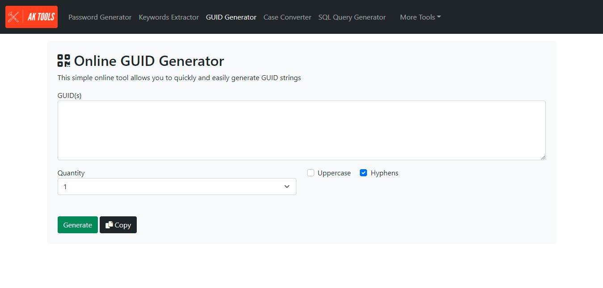

# guid-generator

A JavaScript library to generate Globally Unique Identifiers (GUID).

  <kbd>
    
  </kbd>

## Description

This easy-to-use GUID JavaScript that lets you generate raw GUID formatted strings.

### Features

- Generate Single GUIDs
- Generate Multiple GUIDs 
- Set GUID Cases
- Set/Remove GUID Hyphens
- Copy Strings Feature

### Built with

- Javascript
- HTML + CSS

### Demo

- [aktools.net/guid-generator/](https://aktools.net/guid-generator/)

## Getting started

### Install

All you have to do is download the source files, no configurations needed. Place the the files somewhere on your system and open the `index.html` file located at: `\guid-generator\index.html`

### Usage

Simply set the number of GUID you want to create under Quantity option, then click Generate button the generate GUID string(s). You can then copy and paste your strings to the desired location.

### See also

- [password-generator](https://github.com/akassama/password-generator)
- [sql-query-generator](https://github.com/akassama/sql-query-generator)
- [case-converter](https://github.com/akassama/keywords-extractor)
- [guid-generator](https://github.com/akassama/guid-generator)
- [text-notepad](https://github.com/akassama/text-notepad)
- [jquery-character-counter](https://github.com/akassama/jquery-character-counter)
- [bootstrap-search-autocomplete](https://github.com/akassama/bootstrap-search-autocomplete)
- [jquery-datables-crud](https://github.com/akassama/jquery-datables-crud)
- [bootstrap-search-autocomplete](https://github.com/akassama/bootstrap-search-autocomplete)
- [akassama-projects](https://github.com/akassama/projects)

### License

This project is licensed under the [MIT License](https://opensource.org/licenses/MIT).